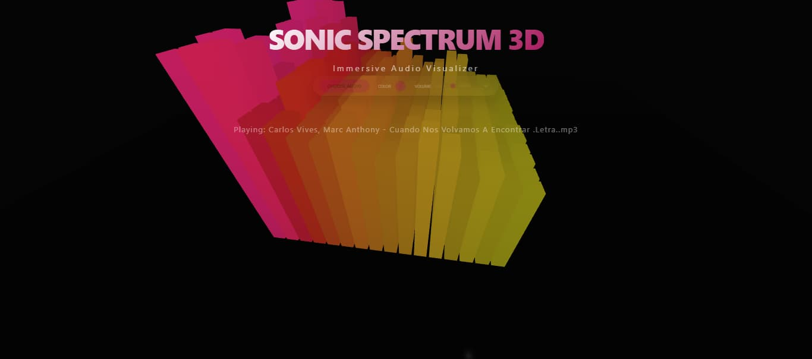

# 🎵 3D Music Visualizer

A stunning, reactive 3D music visualizer built for the web. Experience your music through dynamic animations, vibrant color spectrums, and a premium glassmorphism interface.



## ✨ Features

- **Reactive 3D Environment**: Bars that dance to the rhythm and frequency of your music.
- **Dynamic Color Spectrum**: Automated color shifts based on a user-selectable base theme.
- **Glassmorphism UI**: A sleek, modern control panel that minimizes during playback for an immersive experience.
- **Full 3D Navigation**: Move around the visualizer to view the audio from any angle.
- **Seamless Audio Control**: Simple play/pause and volume management.

## 🚀 Getting Started

### Prerequisites

This project uses [Bun](https://bun.com) for a fast development experience.

### Installation

1. Install dependencies:
   ```bash
   bun install
   ```

2. Start the development server:
   ```bash
   bun run dev
   ```

3. Open your browser to the local server address shown in your terminal.

## 🛠️ Built With

- **Three.js** - 3D Graphics Engine
- **Vite** - Frontend Tooling
- **TypeScript** - Type Safety
- Made with **Vide Code**

## ☕ Support the Project

If you enjoy this visualizer, consider buying me a coffee!

[](https://www.buymeacoffee.com/cmorales)

---

Developed by [cmorales](https://github.com/cmorales)
